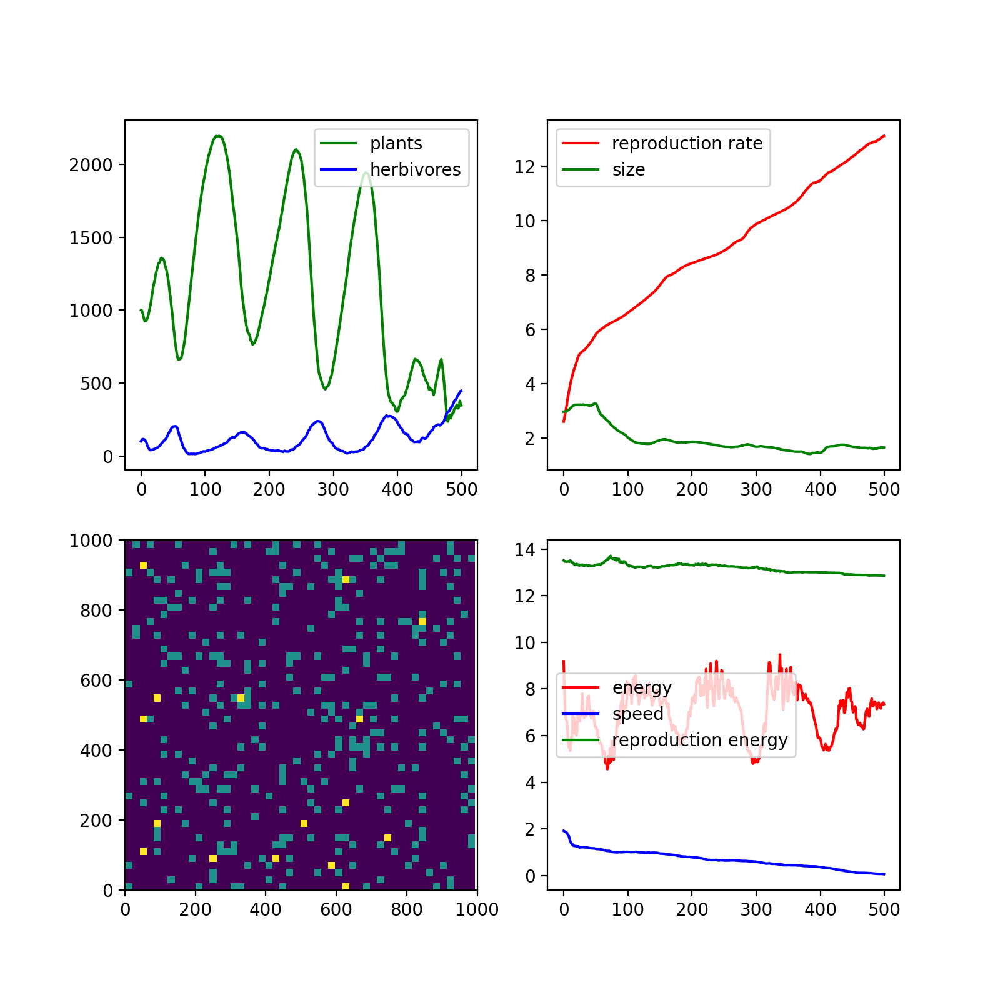

## Natural Selection Simulator

Programming challenge. Far from finished

## TODO 

Herbivore properties

Energy 
    - How long before death
    - increases with each plant eatens size
    - decreases each step by set amount *

Size 
    - How big it is
    - Disadvantage - Bigger animals move much slower
    - Advantage - Bigger animals can survive for longer without starving

Speed - 
    - How fast it is (how large a move it can make)
    - Disadvantage - Faster animals use more energy
    - Advantage - Faster animals can move further

Perception 
    - How far away can it see food
    - Disadvantage - Uses more energy
    - Advantage - Can find targets easier

Reproduction energy
    - How much does it need to eat to reproduce
    - Disadvantage - Lower values leave the creature with less energy - low resource worlds will then kill them
    - Advantage - Lower values mean faster reproduction

life expectancy - How long will it live for

Plant properties

